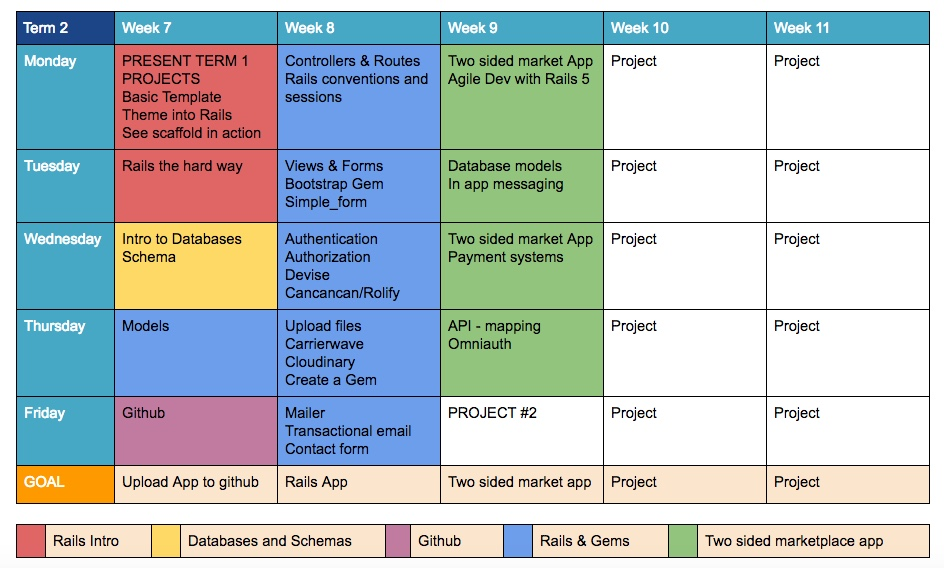

# Coder Factory Academy - Fast Track

##Term 1

<table>
<tr><th colspan="5">Week 1</th></tr>
	<tr>
		<td><a href="term-1/week-1/day-1/DailyPlanT1-W1-D1.md">Day 1</a></td>
		<td><a href="term-1/week-1/day-2/DailyPlanT1-W1-D2.md">Day 2</a></td>
		<td><a href="term-1/week-1/day-3/DailyPlanT1-W1-D3.md">Day 3</a></td>
		<td><a href="term-1/week-1/day-4/DailyPlanT1-W1-D4.md">Day 4</a></td>
		<td><a href="term-1/week-1/day-5/DailyPlanT1-W1-D5.md">Day 5</a></td>
</tr>
</table>

<table>
<tr><th colspan="5">Week 2</th></tr>
	<tr>
		<td><a href="term-1/week-2/day-1/DailyPlanT1-W2-D1.md">Day 1</a></td>
		<td><a href="term-1/week-2/day-2/DailyPlanT1-W2-D2.md">Day 2</a></td>
		<td><a href="term-1/week-2/day-3/DailyPlanT1-W2-D3.md">Day 3</a></td>
		<td><a href="term-1/week-2/day-4/DailyPlanT1-W2-D4.md">Day 4</a></td>
		<td><a href="term-1/week-2/day-5/DailyPlanT1-W2-D5.md">Day 5</a></td>
</tr>
</table>

<table>
<tr><th colspan="5">Week 3</th></tr>
	<tr>
		<td><a href="term-1/week-3/day-1/DailyPlanT1-W3-D1.md">Day 1</a></td>
		<td><a href="term-1/week-3/day-2/DailyPlanT1-W3-D2.md">Day 2</a></td>
		<td><a href="term-1/week-3/day-3/DailyPlanT1-W3-D3.md">Day 3</a></td>
		<td><a href="term-1/week-3/day-4/DailyPlanT1-W3-D4.md">Day 4</a></td>
		<td><a href="term-1/week-3/day-5/DailyPlanT1-W3-D5.md">Day 5</a></td>
</tr>
</table>

<table>
<tr><th colspan="5">Week 4</th></tr>
	<tr>
		<td><a href="term-1/week-4/day-1/DailyPlanT1-W4-D1.md">Day 1</a></td>
		<td><a href="term-1/week-4/day-2/DailyPlanT1-W4-D2.md">Day 2</a></td>
		<td><a href="term-1/week-4/day-3/DailyPlanT1-W4-D3.md">Day 3</a></td>
		<td><a href="term-1/week-4/day-4/DailyPlanT1-W4-D4.md">Day 4</a></td>
		<td><a href="term-1/week-4/day-5/DailyPlanT1-W4-D5.md">Day 5</a></td>
</tr>
</table>

<table>
<tr><th colspan="5">Week 5</th></tr>
	<tr>
		<td><a href="term-1/week-5/day-1/DailyPlanT1-W5-D1.md">Day 1</a></td>
		<td><a href="term-1/week-5/day-2/DailyPlanT1-W5-D2.md">Day 2</a></td>
		<td><a href="term-1/week-5/day-3/DailyPlanT1-W5-D3.md">Day 3</a></td>
		<td><a href="term-1/week-5/day-4/DailyPlanT1-W5-D4.md">Day 4</a></td>
		<td><a href="term-1/week-5/day-5/DailyPlanT1-W5-D5.md">Day 5</a></td>
</tr>
</table>

##Term 2

<table>
<tr><th colspan="5">Week 7</th></tr>
	<tr>
		<td><a href="term-2/week-7/day-1/DailyPlanT2-W7-D1.md">Day 1</a></td>
		<td><a href="term-2/week-7/day-2/DailyPlanT2-W7-D2.md">Day 2</a></td>
		<td><a href="term-2/week-7/day-3/DailyPlanT2-W7-D3.md">Day 3</a></td>
		<td><a href="term-2/week-7/day-4/DailyPlanT2-W7-D4.md">Day 4</a></td>
		<td><a href="term-2/week-7/day-5/DailyPlanT2-W7-D5.md">Day 5</a></td>
</tr>
</table>

<table>
<tr><th colspan="5">Week 8</th></tr>
	<tr>
		<td><a href="term-2/week-8/day-1/DailyPlanT2-W8-D1.md">Day 1</a></td>
		<td><a href="term-2/week-8/day-2/DailyPlanT2-W8-D2.md">Day 2</a></td>
		<td><a href="term-2/week-8/day-3/DailyPlanT2-W8-D3.md">Day 3</a></td>
		<td><a href="term-2/week-8/day-4/DailyPlanT2-W8-D4.md">Day 4</a></td>
		<td><a href="term-2/week-8/day-5/DailyPlanT2-W8-D5.md">Day 5</a></td>
</tr>
</table>

<table>
<tr><th colspan="5">Week 9</th></tr>
	<tr>
		<td><a href="term-2/week-9/day-1/DailyPlanT2-W9-D1.md">Day 1</a></td>
		<td><a href="term-2/week-9/day-2/DailyPlanT2-W9-D2.md">Day 2</a></td>
		<td><a href="term-2/week-9/day-3/DailyPlanT2-W9-D3.md">Day 3</a></td>
		<td><a href="term-2/week-9/day-4/DailyPlanT2-W9-D4.md">Day 4</a></td>
		<td><a href="term-2/week-9/day-5/DailyPlanT2-W9-D5.md">Day 5</a></td>
</tr>
</table>

<table>
<tr><th colspan="5">Week 10</th></tr>
	<tr>
		<td><a href="term-2/week-10/day-1/DailyPlanT2-W10-D1.md">Day 1</a></td>
		<td><a href="term-2/week-10/day-2/DailyPlanT2-W10-D2.md">Day 2</a></td>
		<td><a href="term-2/week-10/day-3/DailyPlanT2-W10-D3.md">Day 3</a></td>
		<td><a href="term-2/week-10/day-4/DailyPlanT2-W10-D4.md">Day 4</a></td>
		<td><a href="term-2/week-10/day-5/DailyPlanT2-W10-D5.md">Day 5</a></td>
</tr>
</table>

<table>
<tr><th colspan="5">Week 11</th></tr>
	<tr>
		<td><a href="term-2/week-11/day-1/DailyPlanT2-W11-D1.md">Day 1</a></td>
		<td><a href="term-2/week-11/day-2/DailyPlanT2-W11-D2.md">Day 2</a></td>
		<td><a href="term-2/week-11/day-3/DailyPlanT2-W11-D3.md">Day 3</a></td>
		<td><a href="term-2/week-11/day-4/DailyPlanT2-W11-D4.md">Day 4</a></td>
		<td><a href="term-2/week-11/day-5/DailyPlanT2-W11-D5.md">Day 5</a></td>
</tr>
</table>

##Term 3

<table>
<tr><th colspan="5">Week 13</th></tr>
	<tr>
		<td><a href="term-3/week-13/day-1/DailyPlanT3-W1-D1.md">Day 1</a></td>
		<td><a href="term-3/week-13/day-2/DailyPlanT3-W1-D2.md">Day 2</a></td>
		<td><a href="term-3/week-13/day-3/DailyPlanT3-W1-D3.md">Day 3</a></td>
		<td><a href="term-3/week-13/day-4/DailyPlanT3-W1-D4.md">Day 4</a></td>
		<td><a href="term-3/week-13/day-5/DailyPlanT3-W1-D5.md">Day 5</a></td>
</tr>
</table>

<table>
<tr><th colspan="5">Week 14</th></tr>
	<tr>
		<td><a href="term-3/week-14/day-1/DailyPlanT3-W2-D1.md">Day 1</a></td>
		<td><a href="term-3/week-14/day-2/DailyPlanT3-W2-D2.md">Day 2</a></td>
		<td><a href="term-3/week-14/day-3/DailyPlanT3-W2-D3.md">Day 3</a></td>
		<td><a href="term-3/week-14/day-4/DailyPlanT3-W2-D4.md">Day 4</a></td>
		<td><a href="term-3/week-14/day-5/DailyPlanT3-W2-D5.md">Day 5</a></td>
</tr>
</table>

<table>
<tr><th colspan="5">Week 15</th></tr>
	<tr>
		<td><a href="term-3/week-15/day-1/DailyPlanT3-W3-D1.md">Day 1</a></td>
		<td><a href="term-3/week-15/day-2/DailyPlanT3-W3-D2.md">Day 2</a></td>
		<td><a href="term-3/week-15/day-3/DailyPlanT3-W3-D3.md">Day 3</a></td>
		<td><a href="term-3/week-15/day-4/DailyPlanT3-W3-D4.md">Day 4</a></td>
		<td><a href="term-3/week-15/day-5/DailyPlanT3-W3-D5.md">Day 5</a></td>
</tr>
</table>

<table>
<tr><th colspan="5">Week 16</th></tr>
	<tr>
		<td><a href="term-3/week-16/day-1/DailyPlanT3-W4-D1.md">Day 1</a></td>
		<td><a href="term-3/week-16/day-2/DailyPlanT3-W4-D2.md">Day 2</a></td>
		<td><a href="term-3/week-16/day-3/DailyPlanT3-W4-D3.md">Day 3</a></td>
		<td><a href="term-3/week-16/day-4/DailyPlanT3-W4-D4.md">Day 4</a></td>
		<td><a href="term-3/week-16/day-5/DailyPlanT3-W4-D5.md">Day 5</a></td>
</tr>
</table>

<table>
<tr><th colspan="5">Week 17</th></tr>
	<tr>
		<td><a href="term-3/week-17/day-1/DailyPlanT3-W5-D1.md">Day 1</a></td>
		<td><a href="term-3/week-17/day-2/DailyPlanT3-W5-D2.md">Day 2</a></td>
		<td><a href="term-3/week-17/day-3/DailyPlanT3-W5-D3.md">Day 3</a></td>
		<td><a href="term-3/week-17/day-4/DailyPlanT3-W5-D4.md">Day 4</a></td>
		<td><a href="term-3/week-17/day-5/DailyPlanT3-W5-D5.md">Day 5</a></td>
</tr>
</table>

##Term 4

